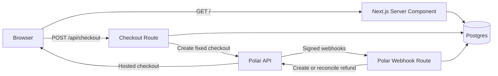

# King of the Hill: Architecture Outline

## Overview

The application is a Next.js App Router service with a server-rendered leaderboard, one client checkout form, Postgres as the source of truth, and Polar as the hosted payment provider. Ranking decisions are made only from signed webhooks and serialized in Postgres.



## Runtime Components

| Component | Responsibility | Primary files |
| --- | --- | --- |
| Home page | Server-render active ranking and quote | `src/app/page.tsx` |
| Checkout form | Browser validation, checkout request, stale-quote refresh | `src/components/take-the-lead-form.tsx` |
| Checkout API | Runtime validation, attempt creation, Polar redirect URL | `src/app/api/checkout/route.ts` |
| Quote API | Return the current server quote | `src/app/api/quote/route.ts` |
| Webhook API | Signature verification and event dispatch | `src/app/api/webhooks/polar/route.ts` |
| Ranking DAL | Queries, locks, settlement, refund state transitions | `src/lib/ranking.ts` |
| Polar service | Checkout creation and refund reconciliation | `src/lib/polar.ts` |
| Pure checkout builder | Construct testable Polar request payloads | `src/lib/polar-checkout.ts` |
| Pure validators | Validate checkout input and Polar orders | `src/lib/checkout-input.ts`, `src/lib/payment.ts` |
| Database client | Lazily cached postgres.js pool | `src/lib/db.ts` |
| Configuration | Validate server environment values | `src/lib/env.ts` |

## Trust Boundaries

### Browser Boundary

The browser may display a quote, but its amount, name, email, and request shape are untrusted. `POST /api/checkout` validates the payload and re-derives the quote from Postgres.

### Polar API Boundary

Checkout responses are trusted only after SDK parsing. The app additionally verifies that the returned selected product matches the request and is not recurring.

### Webhook Boundary

The route reads the raw body and verifies Standard Webhooks headers through `@polar-sh/sdk/webhooks`. A valid signature proves Polar delivery, but an order must still match app metadata and a persisted attempt.

### Database Boundary

Postgres is authoritative for the active ranking, attempt state, idempotency, and refund work. Provider calls are never treated as atomic with a database transaction; durable state and reconciliation bridge that boundary.

## Data Model

### `rank_attempts`

One row is created before each Polar checkout request. It stores:

- App-generated UUID and normalized public display name.
- Expected cent amount and Polar product ID.
- Polar checkout ID and expiration after checkout creation.
- Polar order ID and signed cumulative order amount fields after payment.
- Attempt state, Polar refund ID, retry count, and timestamps.

Important uniqueness constraints cover checkout ID, order ID, and refund ID.

### `ranks`

One accepted attempt may create one rank. It stores:

- A unique foreign key to `rank_attempts`.
- Immutable public display name and paid amount.
- Claim timestamp and optional revocation timestamp.

A partial unique index prevents duplicate active amounts. Board and quote queries include only rows where `revoked_at IS NULL`.

## Attempt State Machine

```text
creating -> open -> accepted -> refunded
    |         |         |
    |         |         +-> refund_pending -> refund_processing
    |         |                                |             |
    |         |                                |             +-> refund_submitted -> refunded
    |         |                                +-> refund_pending on retryable failure
    |         +-> refund_pending when payment is stale
    |         +-> manual_review when a stale payment has no API-refundable amount
    +-> failed when Polar checkout creation or persistence fails
```

Webhook redelivery may revisit terminal or in-progress states. State checks make accepted and refund decisions idempotent.

## Request Flows

### Page Read

1. `src/app/page.tsx` calls `listRanks()`.
2. `listRanks()` selects up to 50 active rows ordered by amount and creation time.
3. The page derives the next display quote from the active leader.
4. A database error renders an unavailable card and no checkout form.

### Checkout Creation

1. The client submits name, email, and displayed amount to `/api/checkout`.
2. `parseCheckoutInput()` validates and normalizes the body.
3. `createCheckoutAttempt()` starts a transaction and locks `ranks` in `SHARE ROW EXCLUSIVE` mode.
4. The transaction calculates the authoritative minimum and returns HTTP 409 if the browser quote is stale.
5. A valid attempt row is inserted and committed.
6. `createRankingCheckout()` creates a fixed USD ad-hoc price with inclusive tax, no discounts, and no trial.
7. Metadata contains `purpose` and `attemptId`; the display name and email are not used as settlement authority.
8. The returned checkout ID and expiration are persisted before the URL is returned to the browser.

### Paid Order Settlement

1. Polar sends `order.paid` to `/api/webhooks/polar`.
2. The route verifies the signature and parses the SDK event.
3. `validateRankingOrder()` checks paid status, one-time purchase semantics, currency, discount state, identifiers, amounts, and app metadata.
4. `settlePaidOrder()` locks the attempt row with `FOR UPDATE`.
5. Local checkout, product, and total are compared with the signed order.
6. The transaction locks `ranks` and recomputes the required amount.
7. An eligible order inserts its rank and marks the attempt accepted atomically.
8. A stale refundable order is marked `refund_pending` atomically.
9. Duplicate order delivery returns the previously decided outcome without another rank.

### Stale Payment Refund

1. `refundStalePayment()` calls `claimPendingRefund()`.
2. Claiming uses `SELECT ... FOR UPDATE`, so lease inspection and state transition are atomic.
3. A current worker yields `busy`; the webhook fails so Polar retries delivery.
4. A new worker records `refund_processing` and increments the retry count.
5. The first attempt creates a refund directly using the signed refundable amount.
6. Later attempts list refunds first and match app metadata to reconcile ambiguous provider timeouts.
7. A successful API response stores the refund ID and provider status.
8. A provider or database error releases the row to `refund_pending` and fails webhook delivery.

### Order Refund or Reversal

1. `order.refunded` may arrive before or after `order.paid` redelivery.
2. App metadata locates the attempt; local checkout and product values are compared.
3. Any positive refunded amount revokes an existing rank under the same ranking lock.
4. The cumulative refunded amount prevents older or duplicate events from moving state backward.
5. A remaining API-refundable amount returns the attempt to `refund_pending`.
6. No remaining amount moves the attempt to `refunded`.
7. `refund.created` and `refund.updated` synchronize automatic refund status and retry failed refunds.

## Concurrency and Consistency

- Checkout attempts do not reserve a rank while a human completes hosted checkout.
- Settlement writers lock their attempt row first, then the `ranks` table.
- `SHARE ROW EXCLUSIVE` self-conflicts, serializing rank decisions across server instances.
- Reads continue while settlement is in progress.
- The transaction evaluates `MAX(active amount)` after obtaining the ranking lock.
- The first valid settlement transaction to commit at a shared price wins.
- Provider API calls occur after database commit; reconciliation handles the lack of a distributed transaction.

## Idempotency

- `rank_attempts.polar_order_id` is unique.
- `ranks.attempt_id` is unique.
- Replayed accepted orders do not insert another rank.
- Replayed stale orders resume or observe refund work.
- Refund retries search Polar by order ID and app metadata before issuing another refund.
- Monotonic handling prevents an older failed-refund event from moving a completed refund backward.

## Environment and Deployment

| Variable | Purpose |
| --- | --- |
| `APP_URL` | Absolute application origin for Polar return URLs |
| `DATABASE_URL` | Postgres connection string |
| `POLAR_SERVER` | `sandbox` or `production` |
| `POLAR_ACCESS_TOKEN` | Checkout and refund API access |
| `POLAR_PRODUCT_ID` | One-time product used for ranking orders |
| `POLAR_WEBHOOK_SECRET` | Signature verification secret |

Production requires HTTPS. Vercel deployments may derive the origin from `VERCEL_URL` when `APP_URL` is not set. Secrets are loaded only by server-only modules.

The webhook runtime must have enough time for one normal 4-second refund API call or two 4-second reconciliation calls. A durable queue is preferable if the deployment platform cannot reliably support that window.

## Error Handling and Observability

- Browser responses use generic messages and do not expose raw provider or database errors.
- Server logs include checkout, webhook type, order, attempt, and refund context where available.
- Signature failures return HTTP 403.
- Retryable settlement and refund failures throw, producing a non-2xx webhook response.
- Unknown or unrelated signed orders are logged and acknowledged without mutating local state.
- `manual_review` is a launch-critical operational alert condition.

Production should add structured logs, error reporting, metrics, and alerts for:

- Checkout provider failures and HTTP 409 rate.
- Invalid signed order reasons.
- `manual_review` attempts.
- Refund attempts, retries, failures, and lease recovery.
- Webhook latency and repeated delivery.
- Database connection and lock wait failures.

## Test Strategy

Current unit tests use Node's test runner through `tsx`:

- `test/unit/money.test.ts`: cent arithmetic and formatting.
- `test/unit/checkout-input.test.ts`: normalization and malformed request handling.
- `test/unit/payment.test.ts`: strict paid-order validation and metadata correlation.
- `test/unit/polar-checkout.test.ts`: fixed USD, inclusive-tax checkout construction.

Required integration coverage before production:

- Apply `sql/schema.sql` to a disposable Postgres database.
- Exercise duplicate and concurrent settlement transactions.
- Verify refund lease acquisition and recovery.
- Verify early and partial refund ordering.
- Complete a Polar sandbox checkout-to-webhook-to-rank flow.
- Create two same-price sandbox checkouts and verify loser refund behavior.
- Confirm customer-balance behavior and the `manual_review` runbook.

## Known Limitations

- `sql/schema.sql` is an initial schema, not a versioned migration system.
- There is no distributed rate limiting on anonymous checkout creation.
- There is no administrative UI for attempts, manual reviews, or refund retries.
- Refund work runs in webhook request processing rather than a durable queue.
- Hosted checkout cannot guarantee card-authorization ordering; webhook transaction ordering defines the winner.
- No local Postgres or Polar integration test can run until credentials and a database are available.
- Polar processing fees are not returned on refunds.
