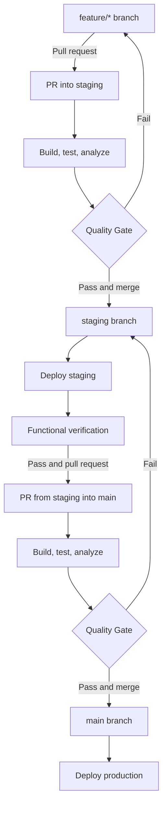
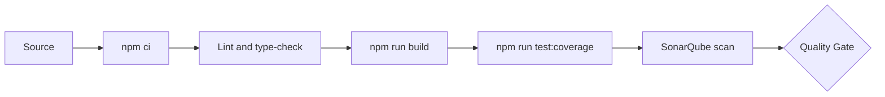

# King of the Hill: CI/CD Architecture

## Purpose

This document defines the branch promotion model, continuous integration quality controls, and the contract for future staging and production deployments. The CI and SonarQube Quality Gate are implemented. The deployment adapter is intentionally deferred until a hosting provider is selected.

## Promotion Map

`Deploy staging`, `Functional verification`, and `Deploy production` are target-state components. They are not active until a deployment provider, environment URLs, and provider credentials are configured.

## Continuous Integration

Every pull request into `staging` or `main`, and every push to either protected branch, runs `.github/workflows/sonarcloud.yml` in this order:

The `Quality Gate` job must complete successfully before a pull request can be merged. The scanner waits for the server-side SonarQube Cloud result instead of only uploading an analysis report.

### Pipeline Controls

| Control | Implementation |
| --- | --- |
| Reproducible install | `npm ci` from the committed lockfile |
| Runtime | Node.js 24 through `actions/setup-node` |
| Static validation | ESLint and TypeScript without emit |
| Production compilation | Next.js production build |
| Unit tests | Node test runner through `tsx` |
| Coverage | `c8` writes `coverage/lcov.info` |
| Analysis | SonarQube Cloud scans `src` and imports LCOV |
| Quality enforcement | `sonar.qualitygate.wait=true` fails the job on a bad gate |
| Supply-chain safety | Third-party actions are pinned to full commit SHAs |
| Duplicate-run control | New commits cancel older runs for the same ref |
| Least privilege | Workflow token is read-only for contents and pull requests |

### Promotion Validation

The workflow rejects pull requests that bypass the intended route:

- Pull requests into `staging` must originate from `feature/*`.
- Pull requests into `main` must originate from `staging`.
- Direct pushes to `staging` and `main` must be disabled with GitHub branch rules.
- Both protected branches must require the `Quality Gate` check before merge.

The source-branch check is enforced in the workflow. Classic branch protection is active on both target branches and requires an up-to-date branch, `Quality Gate`, and `SonarCloud Code Analysis` before merge.

## SonarQube Quality Gate

`sonar-project.properties` separates application source from tests and imports the LCOV report produced earlier in the same job. The scan checks reliability, maintainability, security, duplication, and new-code coverage.

A scan upload succeeding is not sufficient. The workflow waits up to five minutes for SonarQube Cloud to calculate the Quality Gate. A failed condition exits the job unsuccessfully and must block merge through the required `Quality Gate` branch rule.

The current gate requires at least 80% coverage on new code. The threshold remains owned by SonarQube Cloud; it is not weakened or bypassed in repository configuration.

## Continuous Deployment Contract

The deployment implementation remains provider-neutral until a target is selected. A future adapter must preserve the following job boundaries.

### Staging

1. Trigger only after a successful quality pipeline on a push to `staging`.
2. Deploy the exact tested commit SHA to a GitHub environment named `staging`.
3. Store provider credentials only in the `staging` environment.
4. Expose the deployed origin as a non-secret environment variable.
5. Run a functional check against the deployed application and its staging database.
6. Require successful verification before opening or merging the promotion pull request to `main`.

### Production

1. Trigger only after a successful quality pipeline on a push to `main`.
2. Deploy the exact tested commit SHA to a GitHub environment named `production`.
3. Store production credentials only in the `production` environment.
4. Use a protected environment with required approval when the repository plan permits it.
5. Run a read-only post-deploy smoke test and report the deployment URL in GitHub.

### Verification Contract

At minimum, automated verification should confirm:

- The application origin responds over HTTPS.
- `GET /api/quote` returns HTTP 200 and valid integer cent values.
- The application can reach the environment-specific Postgres database.
- No real Polar checkout or refund is created by a smoke test.

Full checkout, webhook, and refund tests belong in a controlled Polar sandbox and should run against staging, not production.

## Environment Boundaries

The future GitHub environments should be configured as follows:

| Environment | Branch | Data and provider mode | Promotion |
| --- | --- | --- | --- |
| `staging` | `staging` | Isolated Postgres and Polar sandbox | Functional verification, then PR to `main` |
| `production` | `main` | Production Postgres and Polar production | Protected approval and production deploy |

Application secrets such as `DATABASE_URL`, `POLAR_ACCESS_TOKEN`, and `POLAR_WEBHOOK_SECRET` must be environment-scoped. Prefer short-lived OIDC authentication for the hosting provider over a repository-wide static deployment token.

## Failure and Recovery

- Install, lint, type-check, build, test, analysis, or Quality Gate failure stops promotion.
- A staging deployment failure leaves `main` unchanged.
- A staging verification failure blocks the `staging` to `main` pull request.
- A production deployment failure must not trigger an automatic database rollback.
- Application rollback should redeploy a previously verified commit; database changes require forward-compatible migrations and a separate recovery plan.
- Workflow logs and deployment output must not print credentials or payment data.

## Repository Controls

Classic branch protection currently applies these controls to both `staging` and `main`:

1. Pull requests are required, including for repository administrators.
2. `Quality Gate` and `SonarCloud Code Analysis` are required checks.
3. A branch must be current with its target before merge.
4. Force pushes and branch deletion are disabled.
5. Review conversations must be resolved before merge.

When deployment begins, create `staging` and `production` GitHub environments and scope deployment secrets to their environment rather than the repository.

## Implementation Status

| Capability | Status |
| --- | --- |
| Feature and promotion path validation | Implemented in workflow |
| Dependency install, validation, build, and tests | Implemented in workflow |
| LCOV generation and SonarQube import | Implemented |
| Blocking server-side Quality Gate | Implemented in workflow |
| Required branch checks | Implemented on `staging` and `main` |
| Staging deployment and functional verification | Deferred until provider selection |
| Production deployment | Deferred until provider selection |
